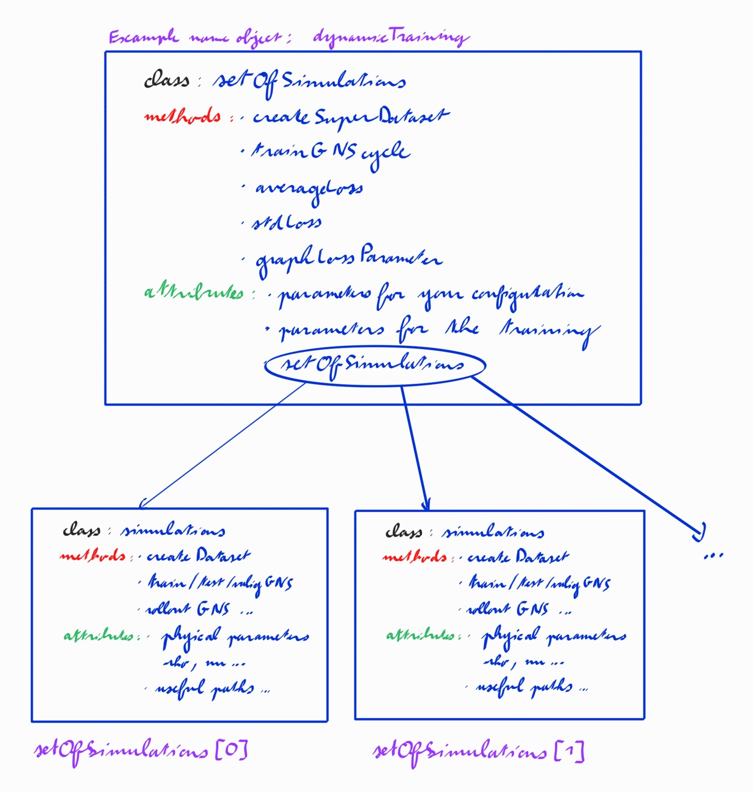

# A commprehensive tool to use GNS 
## Table of Contents
- [Introduction](#introduction)
- [Installing the programs](#installing-the-programs)
- [How to use the "easier" version](#how-to-use-the-easier-version)
    - [Instantiation](#instantiation)
    - [Creating the dataset](#creating-the-dataset)
    - [The training](#the-training)
    - [A few other tools to test the GNS](#a-few-other-tools-to-test-the-gns)
- [Things to look at when debugging](#things-to-look-at-when-debugging)
    - [Issue during the run.subprocess](#issue-during-the-runsubprocess)
    - [Issue with the number of parameters](#issue-with-the-number-of-parameters)

## Introduction
The main goal is to create a python interface which is easier to use compare to the GNS code "right out of the box". The code contains two levels of interface : 
- The first one contained in Simulations.py allows more flexibility giving just the tools to avoid the bash editing between each training cycle. It also convert the bgeo file in the right format.
- The second one is in SetOfSimulations.py and contains everything to make the all code really easy to use. However, some flexibility had to be taken away.

## Installing the programs
First the **GNS code needs to be imported** and set as said in their [github page](https://github.com/geoelements/gns). The differents packages need to be imported in a conda environment called GPU_pytorch1. Else some of the line of code in Simulations.py need to be modify (the command in the subprocess.run need to be adapted).

Then **another environment needs to be configured** with a copy of the python used by Houdini. To do that, create a new conda environment. Then copy all the files concerening python in the Houdini installation in the folder for the conda environments. Add these lines to the bashrc (needs to be adapted to fit your implementation, ??which lines??) : 

Then try to import the module hou. If the module is imported, the environment should be set.

The **last step** occurs when using the code contained with this file. Instantiate at least one time the class setOfSimulations with the right adress. That way, all the bash files and others used later should be modified to fit your configuration. You have to put :
- the path to where you want to store the output of the MPM simulation in **pathBgeo**.
- the path to the location of the data ready for the GNS should be placed in **pathNpz**.
- **pathExe** should be the location of the different bash file linked with this code.
- **pathGNS** correspond to the path of the gns folder with all their codes.
- the path to the mpm.exe file should be placed in **pathMPM**.
- And finally, the .lua file used to put the parameters should be placed in **pathLua**.

Be careful, sometime only the folder path should be put and sometimes the all path with the file name. Refer to the adresses by default to figure it out.

## Quick explanation of the code

The objective of this library is to link the MPM and GNS algorithms so they may work together. Another goal was to observe how the dependance of the loss to a a parameter impact the scaling process. In particular, is working for a constant loss across the range of a parameter useful to get better scaling?

In order to see those aspects, the code is structured in two classes.

The first one, **simulations**, is build to train the GNS around a specific set of physical parameters and then test and valid the algorithm at exactly those parameter. it will also contain all the path to files related to this specific set of parameters.

The second class, **setOfSimulations**, is here to regroup all the different class simulations. The methods and paths are more general. They act on all the simulations, "no matter the physical parameters". 

## How to use the "easier" version
### Instantiation
    
The first thing to do is to create an object set of simulations. WHen doing saw consider these things : 
- If you want to restart the training and you have built the different class simulations, put them in **setOfSimulations** and precise the **nbTrainingSteps** done where you want to restart the training. Else, leave these as default parameters.
- Then precise the **nbSimuTraining**, **nbSimuTest**, **nbSimuValid** with the numbers you want. These will be the number of simulations used for each set of physical parameters.
- You also have to choose the number of training steps per cycles for each set of physical parameters in nbStepsPerParametersPerCycle.
- At last, precise the number of frames of each simulations in **nbFrames**. Be careful of the difference with the end frame of MPM.

### Creating the dataset

In order to create the dataset for the training, validation and testing of the GNS, a method was built. If the setOfSimulations is empty, it will build the the dataset from scratch by **running the MPM algorithm** and then converting the soluition to npz format. 

If there already exists some simulations in the list setOfSimulations, then it will add new ones. 

When you use the method createSuperDataset, you only have to choose two things : 
- The physical **parameters** describing the different objects simulation. It is a list of dictionnary of the form : {"young" : , "nu" : , "rho" : , "friction angle" : }
- the number of points representing the volume used as an obstacle.

### The training

To train the GNS algorithm, you just have to call the method tainGNScycle. No arguments need to be put. Just know that it will reorganise the number of training simulations to reduce the standard deviation of the loss if the list nbSimuTraining is longer than one.

For now, the other common action on the GNS (testing and rollout) need to be run from the class simulations.

### A few other tools to test the GNS

I put two method to have a global idea of the loss across all the different parameters :
- averageLoss 
- stdLoss to get the standard deviation of the loss function

There is also a method graphLossParameter which takes the parameter that interests us and plot the loss as a function of that parameter.

## Things to look at when debugging
### Issue during the run.subprocess

If errors appears during the parts where the GNS or MPM code is running, you can locate the error by printing the log. For that, add *print(resultGNS.stderr)* just after the command subprocess.run.

### Issue with the number of parameters 

If you change the model and therefore the number of parameters, you may raise unexpected errors in the GNS code. The firs thing to do do is to modify to line of code where the number of parameters is "hardcoded" : 
- in learned_simulator.py in method encoder_preprocessor(...), material_property.view(nparticle, **nparameters**), nparameters need to be replaced by the number of parameters you have.
- in data_loader.py lines 105 and 210, np.full((positions.shape[0], **nparameter**)), nparameters need to be replaced by the number of parameters you have.

Sommething a bit more logic, you have to modify the metadata.json file. Put the right number of parameters in material_feature_len and put 37+nbParameters in nnode_in.

